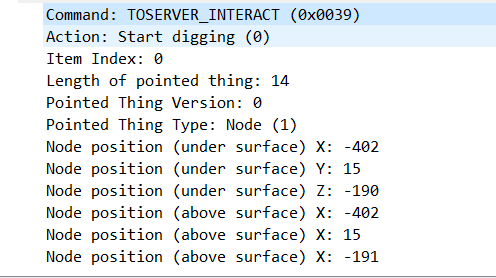
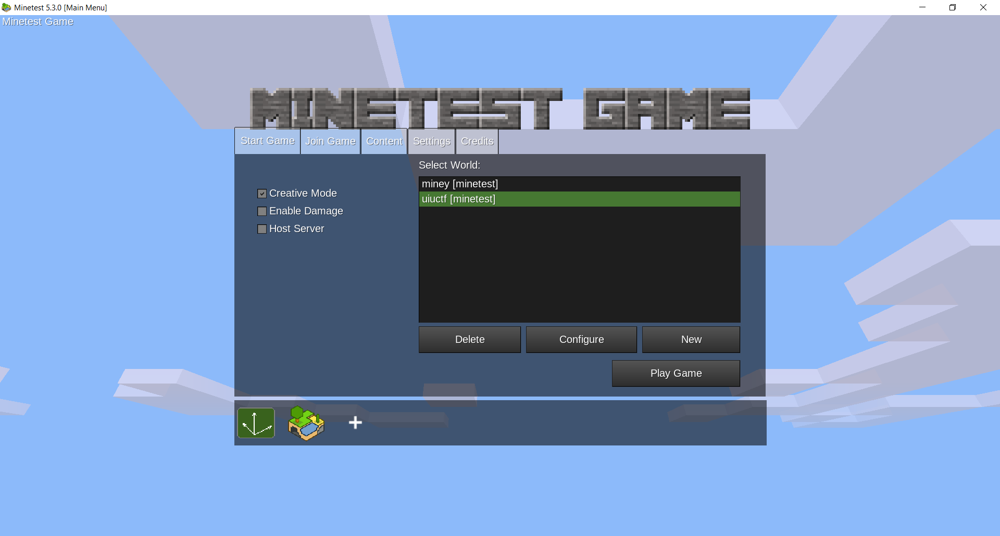
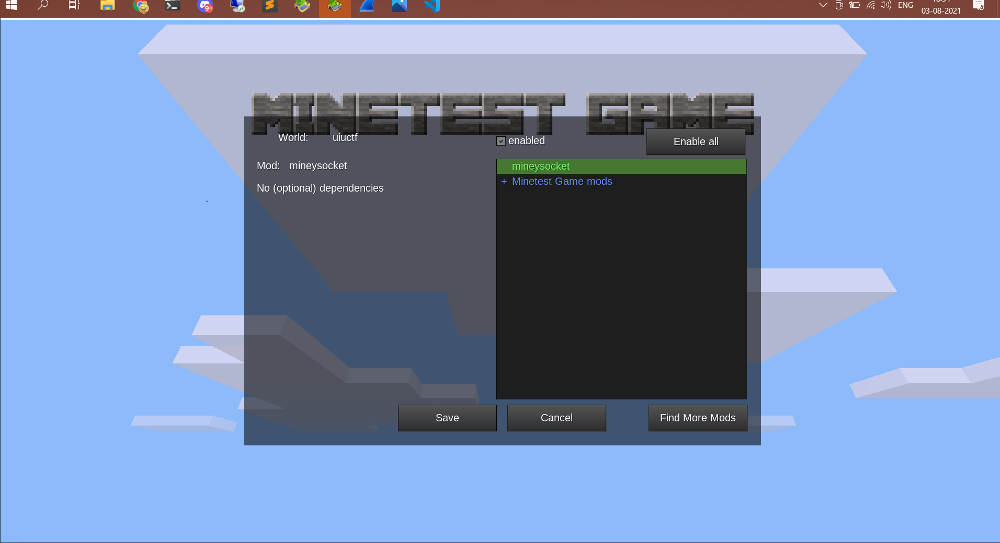

# toobeetootee (Forensics,UIUCTF 2021)

## Overview
To parse the udp data into different server/client commands using the wireshark extension .Carve the coordinated of placed/removed blocks .  And then use miney library to place/remove block in the world


>I didnt solve the challenge during the ctf

>TL;DR
I had not ever played minetest before so bear the very lenghty writeup

## Part1: Parsing the Pcap

The main part here was to find the wireshark plugin to parse the udp data
While going through ctf discord server i found out about the [plugin](https://github.com/minetest/minetest/blob/master/util/wireshark/minetest.lua)

if you didnt know about the plugin the other way is to go through their documentation about the [communication protocol](https://dev.minetest.net/Engine/Network_Protocol)
and make your own parser for udp packets

To install the plugin follow this [thread](https://stackoverflow.com/questions/27978243/adding-plugin-for-a-custom-protocol-into-wireshark)

after that load the pcap file in wireshark 


Here you can play around and look at the different types of server/client commands being sent via udp

The command that we are most interested in is **Command: TOSERVER_INTERACT (0x0039)**



there are typically 6 actions 

```
        [0] = "Start digging",
		[1] = "Stop digging",
		[2] = "Digging completed",
		[3] = "Place block or item",
		[4] = "Use item",
		[5] = "Activate held item",

```
We are only interested in first 4 actions

The first 3 are related to removing a block from the map so we place the block here to reverse the effect

the 4th one is related to placing a block on the map so me remove the block to reverse the effect 

```python
import pyshark
import json 

cap=pyshark.FileCapture("./toobeetootee.pcap")
points=[]

for c  in cap:
	try:
		if str(c["MINETEST.CLIENT"].command)=="0x00000039":
			if str(c["MINETEST.CLIENT"].interact_action) in ["0","1","2"]:
#				print(f"add block at x =",c["MINETEST.CLIENT"].interact_pointed_above_x," y = ",c["MINETEST.CLIENT"]._get_all_fields_with_alternates()[-2].show," z = ",c["MINETEST.CLIENT"]._get_all_fields_with_alternates()[-1].show)
#place a block of brick so as to differentiate from surroundings
				points.append({"name":"brick","x":int(c["MINETEST.CLIENT"].interact_pointed_above_x),"y":int(c["MINETEST.CLIENT"]._get_all_fields_with_alternates()[-2].show),"z":int(c["MINETEST.CLIENT"]._get_all_fields_with_alternates()[-1].show)})			
			elif str(c["MINETEST.CLIENT"].interact_action) in ["3"]:
#				print(f"remove block at x =",c["MINETEST.CLIENT"].interact_pointed_above_x," y = ",c["MINETEST.CLIENT"]._get_all_fields_with_alternates()[-2].show," z = ",c["MINETEST.CLIENT"]._get_all_fields_with_alternates()[-1].show)
#place a block of air to remove a block
				points.append({"name":"air","x":int(c["MINETEST.CLIENT"].interact_pointed_above_x),"y":int(c["MINETEST.CLIENT"]._get_all_fields_with_alternates()[-2].show),"z":int(c["MINETEST.CLIENT"]._get_all_fields_with_alternates()[-1].show)})			
	except:
		pass

with open("points.json","w") as outfile:
	json.dump(points,outfile)
```
So now we have a list of points where to place/remove blocks

## Part2:Automating Minetest

So while searching for ways of automating in minetest i came across this awesome python library [miney](https://github.com/miney-py/miney)

It comes bundled with minetest as well so one less thing to download

to load our world in minetest browse to the unzipped miney folder 
the exact path being `Downloads\miney_windows_x64\miney_x64\Minetest\worlds`
paste the world folder(renamed it to uiuctf)  here

after that start `miney_launcher.exe`


start minetest



>Note: make sure to add the miney mod to your world using `configure` button for miney to communicate with your world



open the world by clicking "Playgame"

Now open python idle from minetest window
create a file and run it 

```python
import miney
import json

#connect to world
mt=miney.Minetest()

#load node coordinates to change
with open("points.json","r") as infile:
	pts=json.load(infile)

mt.node.set(pts)
```

>if you want to read more about the API [docs](https://miney.readthedocs.io/en/latest/objects/Node.html)

If all went well you should see the initial flag modify

  

>Its not that clear but the flag is **uiuctf{BudG3t_c4ves_N_cl1fFs}**


>Hope you found the writup interesting :)
